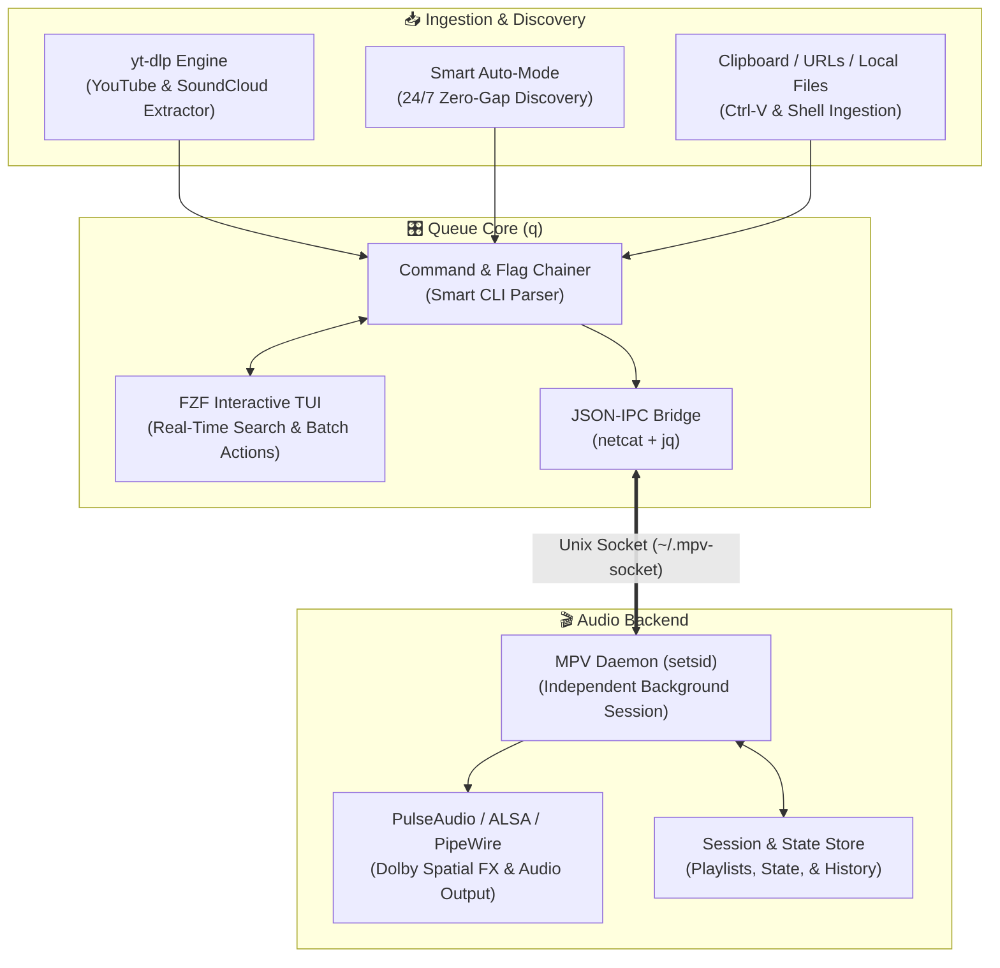

<div align="center">


# 🎵 Queue (`q`) — The Ultimate MPV Music Engine

<p align="center">
  <b>Turn lightweight MPV into an intelligent, feature-packed terminal music player.</b><br>
  <i>24/7 Auto-Discovery • Instant YouTube & SoundCloud Streaming • Interactive FZF TUI • Zero-Bloat</i>
</p>

<p align="center">
  <a href="#-quick-start"></a>
  
  
  
  
  
</p>

<p align="center">
  <a href="#-what-is-queue-q"><b>What is Queue?</b></a> •
  <a href="#-interactive-tui-preview"><b>TUI Showcase</b></a> •
  <a href="#-quick-start"><b>Quick Start</b></a> •
  <a href="#-cheat-sheet"><b>Commands</b></a> •
  <a href="#-unlocking-studio-audio-quality-youtube-cookies-setup"><b>Audio Quality & Cookies</b></a> •
  <a href="#-smart-auto-mode-q--auto"><b>Auto-Mode</b></a> •
  <a href="#-why-queue-vs-standard-players"><b>Why Queue?</b></a> •
  <a href="#-built-with-ai-augmented-development"><b>AI Development</b></a>
</p>

---

</div>

## 🌟 What is Queue (`q`)?

**Queue** (invoked everywhere via the convenient shorthand command **`q`**) is a unified command center designed for music lovers who live in the terminal. Instead of reinventing media playback, Queue elegantly bridges together the most powerful Unix tools—**MPV**, **yt-dlp**, **fzf**, **jq**, and **netcat**—transforming a barebones CLI player into a rich, reactive, background-resilient music player.

<p align="center">
  
</p>

<details>
<summary><b>🔍 View Raw Mermaid Flowchart Code</b></summary>



</details>

### 🧩 Under the Hood:
| Tool | Role in `q` |
| :--- | :--- |
| 🎬 **[MPV](https://mpv.io/)** | High-fidelity, ultra-lightweight audio backend and equalizer |
| 📥 **[yt-dlp](https://github.com/yt-dlp/yt-dlp)** | Decrypts and streams audio directly from YouTube & SoundCloud without local files |
| 🔍 **[fzf](https://github.com/junegunn/fzf)** | Lightning-fast fuzzy search interface with live now-playing banners |
| ⚡ **netcat & jq** | Zero-latency JSON-IPC channel controlling MPV without stopping playback |

---

## 🖥️ Interactive TUI Preview

Launch the full-screen interactive queue simply by typing `q`:

<p align="center">
  
</p>

## ⚡ Why Queue (`q`) vs Standard Players?

| Feature | Queue (`q`) | Spotify / Desktop Apps | Plain MPV CLI |
| :--- | :---: | :---: | :---: |
| **RAM Usage** | **< 15 MB** | 500 MB – 1.2 GB (Electron) | ~15 MB |
| **24/7 Smart Auto-Discovery** | ✅ (`q -auto` Zero-Gap) | ✅ (Algorithm) | ❌ |
| **YouTube & SoundCloud Streaming** | ✅ Zero local storage | ❌ Spotify catalog only | ⚠️ Single URLs only |
| **Headless Background Daemon** | ✅ Continuous (`setsid`) | ❌ Window required | ❌ Blocks terminal |
| **Interactive Fuzzy Search (FZF)** | ✅ Instant (0ms) | ⚠️ Slower GUI search | ❌ None |
| **Real-Time Live TUI Auto-Sync** | ✅ Instant Fingerprint Sync | ⚠️ Cloud polling delay | ❌ None |
| **Zero-Stutter Audio Architecture** | ✅ 48kHz Resampler & 1s Buffer | ⚠️ High CPU usage | ⚠️ Sinks drop on load |
| **WSL2 / Linux Virtualization Hardened**| ✅ Native Pulse/SHM Bypass | ⚠️ Audio desync / crackle | ⚠️ Buffer underruns on VM |
| **Dead Link Auto-Cleaner** | ✅ `q -clean` | ❌ None | ❌ None |

---

## 🚀 Quick Start

### 1. Clone & Install
```bash
git clone https://github.com/ravin-ship-it/queue.git
cd queue
./install.sh
```

> **⚡ Live Symlink Architecture**: `install.sh` links `~/.local/bin/q` directly to your cloned repository. When you run `git pull` in the future, all updates and bug fixes apply **instantly in real time without ever needing to run `install.sh` again!**
>
> **🌍 Cross-Platform Compatibility**: Automatically configures dependencies across **Ubuntu/Debian/WSL**, **Arch Linux**, **Fedora**, **macOS (Homebrew)**, and **Termux (Android)** with universal Netcat (`nc`/`ncat`) detection.

### 2. Apply Shell Integration
```bash
# For Zsh users:
source ~/.zshrc

# For Bash users:
source ~/.bashrc
```

### 3. Play Music!
```bash
# Open interactive player:
q

# Search & play instantly from YouTube:
q "blinding lights the weeknd"
```

---

## 🕹️ Everyday Usage & Examples

### 🔍 Instant Streaming & Ingestion

<p align="center">
  
</p>

```bash
# 1. Search YouTube and pick from top results
q "linkin park in the end"

# 2. Force specific provider search
q yt "synthwave radio"
q sc "lofi chill beats"

# 3. Queue a direct YouTube video or entire playlist
q "https://www.youtube.com/watch?v=dQw4w9WgXcQ"

# 4. Queue a local folder or file
q ~/Music/favorite_song.mp3

# 5. Pipe tracks or text lists directly
cat playlist_urls.txt | q
```

### ✨ Smart Destination Selection (`New Queue`, `Active Queue`, `Playlists`)

Whenever you search for songs or load playlists, `q` presents an interactive destination selector:
- **`✨ New Queue`**: Clears the current session and starts a fresh queue with the selected tracks, beginning playback immediately.
- **`🎧 Active Queue`**: Appends the tracks seamlessly to your current playing session without interrupting playback.
- **`📂 Playlists`**: Directly routes the selected tracks to a newly created or existing saved playlist.

> 💡 **Auto-Play on Ingestion**: If MPV is idle or stopped, adding tracks or running a search automatically starts playback right away! If music is already playing, tracks are queued smoothly in the background.

### 🔗 Multi-Argument & Command Chaining

`q` features an intelligent command parser that supports **chaining multiple actions, searches, and maintenance flags** in a single execution line:

<p align="center">
  
</p>

```bash
# 🔎 Batch Search & Queue: Search and queue multiple songs sequentially
q "linkin park numb" "starset my demons" "skillet the resistance"

# 🧹 Multi-Flag Maintenance: Clean dead/deleted videos AND remove duplicates in one go
q -clean -rmr

# ⚡ Control Chaining: Jump to track 5 and set volume to 85% simultaneously
q -p 5 -v 85

# 🚚 Batch Queue Editing: Move track 1 to 5 and swap tracks 2 and 8
q -mv 1 5 -sw 2 8

# ❓ Need Help? Launch the built-in manual & reference guide
q -h     # or: q help
```

---

## 📖 Cheat Sheet

You can use standard short flags (`q -p`) or clean smart commands (`q play`).

### 🎵 Playback & Audio
| Command | Flag | Action |
| :--- | :--- | :--- |
| `q play [N]` | `q -p [N]` | **Play / Pause** toggle, or jump to track `N` *(restarts from start if stuck/EOF)* |
| `q pause` | `q -pause` | Pause active playback |
| `q next` | `q -next` | Skip to next track |
| `q prev` | `q -prev` | Return to previous track |
| `q stop` | `q -stop` | Gracefully quit MPV and unhook audio |
| `q vol [0-130]` | `q -v [N]` | View or set playback volume |
| `q fx [on\|off]`| `q -fx` | Toggle spatial Dolby-like audio profile |
| `q shuffle` | `q -shuf [list]` | Toggle shuffle mode *(or randomize queue entries)* |
| `q auto` | `q -auto` | **Toggle 24/7 Auto-Discovery Radio Mode** |
| `q info` | `q -i` | Display live playback quality, audio bitrate, and sample rate |
| — | `q -l` / `q -lp` | Toggle Track Loop / Playlist Loop |

---

### 📋 Queue Management
| Command | Flag | Action |
| :--- | :--- | :--- |
| `q remove [N]` | `q -rm [N\|query]` | Remove track by index, title search, or remove currently playing track |
| `q move <A> <B>` | `q -mv <A> <B>` | Move track from position `A` to `B` |
| `q swap <A> <B>` | `q -sw <A> <B>` | Swap track positions `A` and `B` |
| `q clear` | `q -clr` | Wipe the current queue |
| — | `q -clean` | Scan and remove private/deleted/dead YouTube videos |
| — | `q -rmr` | Remove all duplicate tracks from queue |
| — | `q -raw` | Print plaintext queue list *(ideal for scripts/pipes)* |

---

### 📁 Custom Playlists & Organization
| Command | Flag | Action |
| :--- | :--- | :--- |
| `q save <name>` | `q -pl-save <name>` | Save active queue as a named playlist |
| `q load [name]` | `q -pl-load [name]` | Load playlist *(opens FZF picker if name omitted)* |
| `q list` | `q -pl-list` | Interactive playlist explorer and manager |
| — | `q -pl-raw [name]` | Print raw playlist names or contents |
| — | `q -pl-rm <name>` | Delete a saved playlist |
| — | `q -pl-clean <name>`| Clean dead/deleted tracks from a saved playlist |
| — | `q -pl-rmr <name>` | Remove duplicate tracks from a saved playlist |
| — | `q -rname <O> <N>` | Rename a playlist or local file |
| — | `q -to <name>` | Route search results directly into a playlist |

---

### 🛠️ System & Maintenance
| Command | Flag | Action |
| :--- | :--- | :--- |
| `q deps` | `q -deps` | Verify core system dependencies (`mpv`, `yt-dlp`, `fzf`, `jq`, `nc`) |
| `q up` | `q -up` | Automatically update `yt-dlp` to the latest release *(no root/sudo needed)* |
| `q help` | `q -h` | Display the interactive boxed help manual |

---

## ⌨️ Interactive Keybindings (FZF Mode)

When navigating the interactive queue (`q`):

| Key | Function |
| :--- | :--- |
| <kbd>Enter</kbd> | **Play focused track** immediately *(or open Batch Actions menu if tracks selected)* |
| <kbd>Tab</kbd> | **Select / Mark track** for multi-item actions *(Move, Remove, Export, New Queue)* |
| <kbd>Alt</kbd> + <kbd>A</kbd> | **Invert selection** (toggle all tracks) |
| <kbd>Insert</kbd> / <kbd>Delete</kbd> | Select All / Deselect All |
| <kbd>Ctrl</kbd> + <kbd>V</kbd> | **Paste URL from clipboard** directly into the queue |
| <kbd>Esc</kbd> / <kbd>Ctrl</kbd> + <kbd>C</kbd> | Exit TUI *(music continues playing uninterrupted)* |

> ⚡ **Futuristic Live Auto-Sync**: The interactive queue uses full queue fingerprinting to update in real-time (~0ms) whenever songs are added, moved (`q -mv`), swapped (`q -sw`), removed (`q -rm`), shuffled (`q -shuf`), or auto-appended by Radio from any terminal session.

---

## 🍪 Unlocking Studio Audio Quality (YouTube Cookies Setup)

By default, YouTube throttles guest/unauthenticated streams to lower-bitrate formats. By connecting your YouTube cookies to `yt-dlp`, you unlock **128–160+ kbps Studio-Quality Audio (Opus/AAC)**, as well as full access to your **Liked Songs (`list=LL`)**, **Private Playlists**, and **Age-Restricted Tracks**.

### 📊 Quality Difference at a Glance:
| Streaming Mode | Codec | Bitrate | Sample Rate | Fidelity Level |
| :--- | :---: | :---: | :---: | :---: |
| **Guest / Unauthenticated** | AAC / Opus | 48 – 96 kbps | 22.05 – 44.1 kHz | Low / Compressed |
| **With YouTube Cookies** | **Opus (Format 251)** / AAC | **128 – 160 kbps** | **48.0 kHz** | **Studio Quality** *(Matches/beats 320k MP3)* |
| **YouTube Premium (with Cookies)** | AAC (Format 141) / Opus | **256 kbps AAC** | **48.0 kHz** | **Maximum Audiophile Hi-Fi** |

---

### 🚀 3-Step Setup Guide:

#### Step 1: Export Cookies from your Browser
1. In Chrome, Edge, Brave, or Firefox, install the open-source extension: **[Get cookies.txt locally](https://chromewebstore.google.com/detail/get-cookiestxt-locally/cclelndahbckbenkjhflpdbgdldlbecc)** (free, safe, no tracking).
2. Go to **[youtube.com](https://youtube.com)** (make sure you are signed into your account).
3. Click the extension icon in your browser toolbar $\to$ click **Export**.

#### Step 2: Copy Cookies into WSL / Linux
In your terminal, copy the downloaded file to `~/.config/yt-dlp/cookies.txt`:
```bash
mkdir -p ~/.config/yt-dlp

# If using WSL2 (copies from your Windows Downloads):
cp /mnt/c/Users/$USER/Downloads/*cookie*.txt ~/.config/yt-dlp/cookies.txt

# Or if running native Linux / macOS:
cp ~/Downloads/*cookie*.txt ~/.config/yt-dlp/cookies.txt
```

#### Step 3: Link in `yt-dlp` Config
Add the cookie flag to your config *(the `./install.sh` installer also preserves this automatically!)*:
```bash
if ! grep -q "cookies.txt" ~/.config/yt-dlp/config; then
    echo "--cookies ~/.config/yt-dlp/cookies.txt" >> ~/.config/yt-dlp/config
fi
```

#### 🧪 Verify with `q -i`:
Start playing any song with `q` and check live decoder stats:
```bash
q -i
```
```text
🎵 Current Playback Quality
   Format:  multi/mov,mp4,m4a,3gp,3g2,mj2
   Codec:   aac / opus
   Bitrate: 131 kbps – 160 kbps
   Rate:    44100 Hz – 48000 Hz
```

---

## 🤖 Smart Auto-Mode (`q -auto`)

When Auto-Mode is enabled:
1. **Intelligent Seed Analysis**: When your queue approaches the end, `q` dynamically analyzes recent tracks and seeds diverse discovery queries across YouTube Mixes (`RDAMVM`) and YouTube Music catalogs.
2. **24/7 Zero-Gap Discovery**: Fetches and prepares candidate tracks in the background before the current song finishes playing.
3. **End-of-Queue (EOF) Awareness**: If playback reaches the end of the queue, Auto-Mode seamlessly discovers, queues, and starts playback of new tracks so silence never interrupts your flow.
4. **Smart User Override Respect**: Automatically pauses auto-discovery if you manually pause playback or activate single-track looping (`q -l`).
5. **Anti-Repetition History Engine**: Maintains an intelligent ring buffer of played track IDs to prevent duplicate plays.

---

## 🧠 Built with AI-Augmented Development

`q` was designed, architected, and continuously refined using **AI-Augmented Development** — an engineering paradigm where human product vision, design intuition, and user feedback pair directly with autonomous AI coding agents.

### 💡 Why AI-Augmented?
- **Root-Cause Resilience**: Complex low-level edge cases (such as WSLg PulseAudio socket unhooking, background daemon session detachment via `setsid`, long-pause HTTPS token expiration recovery, and real-time asynchronous TUI IPC) were diagnosed and solved at the protocol level.
- **Architectural Cohesion**: Features across 7 modular subsystems (`media`, `queue`, `playlist`, `search`, `batch`, `ui`, `utils`) maintain consistent error handling, cross-platform compatibility, and zero-latency inter-process synchronization.
- **Continuous Evolution**: Performance benchmarks, non-blocking asynchronous routines, and terminal aesthetics are continuously iterated and battle-tested in real-world environments.

---

## 🛠️ Uninstallation

```bash
./uninstall.sh
```
Cleanly removes all executables, shell wrapper functions, configurations, and cache files.

---

## 🤝 Contributing & License

Contributions, feature requests, and bug reports are warmly welcome! Feel free to open an issue or pull request.

Distributed under the **GPL-3.0 License**. See [LICENSE](file:///home/xen/queue/LICENSE) for more information.
